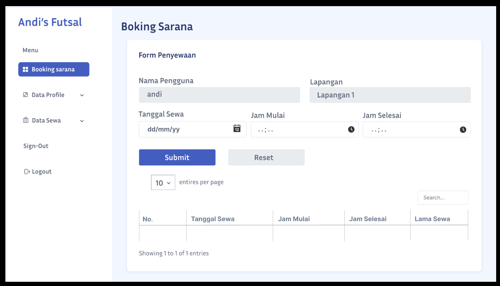

# 🏟️ Andi's Futsal - Booking App

A web-based futsal field booking application built with Laravel. This system allows users to easily book futsal courts online, while administrators can efficiently manage bookings, schedules, customers, and payment transactions.

---

## 📸 Application Screenshots

### Homepage


### Booking Page


---

# 🏟️ Andi's Futsal - Futsal Court Booking App

A web-based application for booking futsal courts, built with Laravel.

## 🛠️ Tech Stack
- PHP & Laravel
- MySQL
- Blade Template
- Vite

## ⚙️ How to Run the Project

### 1. Clone the repository
```bash
git clone https://github.com/SarifahMuliani/Booking-App.git
cd Booking-App
```

### 2. Install dependencies
```bash
composer install
npm install
```

### 3. Setup environment
```bash
cp .env.example .env
php artisan key:generate
```

### 4. Setup database
- Create a MySQL database named `andisfutsal`
- Import the `andisfutsal.sql` file
- Update your database credentials in the `.env` file

### 5. Run the application
```bash
npm run dev
php artisan serve
```

### 6. Open in browser
```
http://localhost:8000
```
